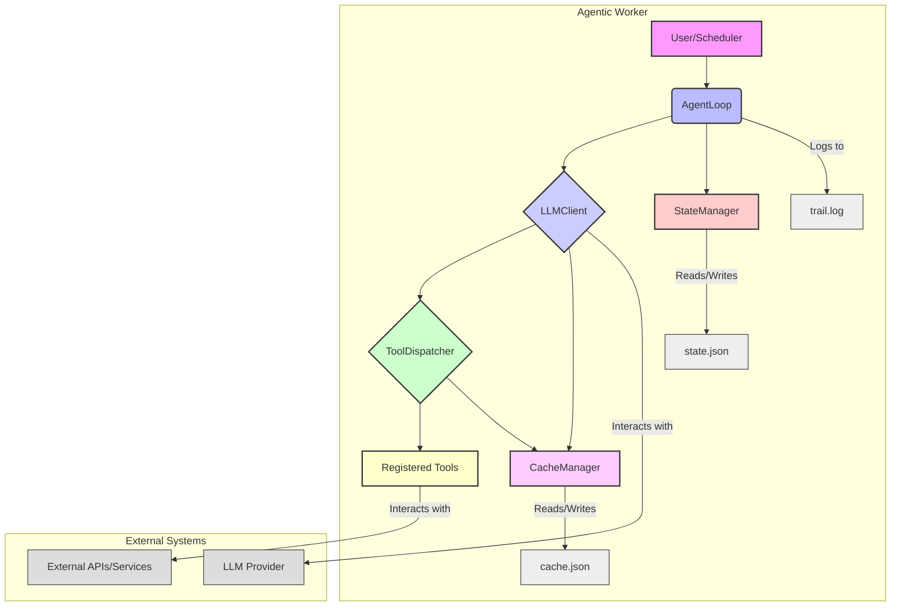

# Agentic Worker Architecture: Deep SSnaHke Pattern Applied to LLM Agents

This document details the architectural principles and design decisions behind the `agentic-worker` skill, drawing inspiration from the **Deep SSnaHke** bash script and adapting its robust patterns for multi-turn LLM interactions with tool execution.

## Core Principles from Deep SSnaHke

Deep SSnaHke is an agentic duplicate hunter that operates with persistence, caching, and parallel processing. The `agentic-worker` skill translates these core ideas into the domain of LLM agents:

| Deep SSnaHke Concept | Agentic Worker Equivalent | Description |
|:---------------------|:--------------------------|:------------|
| `STATE_DIR` (`~/.deep_ssnahke`) | `StateManager` (`~/.agentic_worker/state.json`) | Persistent storage for conversation history, agent configuration, and other mutable state. Ensures the agent can resume operations across restarts. |
| `CACHE` (`cache.tsv`) | `CacheManager` (`~/.agentic_worker/cache.json`) | Hash-based caching for LLM responses and tool execution results. Prevents redundant computations and API calls, improving efficiency and reducing costs. |
| `xargs -P` (parallel hashing) | `ToolDispatcher` (`concurrent.futures.ThreadPoolExecutor`) | Executes multiple tool calls concurrently, leveraging available CPU cores or threads to speed up multi-tool workflows. |
| `while true; do ... sleep $INTERVAL; done` | `AgentLoop` (daemon mode) | Provides a continuous operational mode where the agent periodically wakes up, performs its tasks, and then sleeps, mimicking a background service. |
| `TRAIL` (`trail.log`) | Structured JSON-lines logging | Comprehensive logging of agent activities, LLM calls, tool dispatches, cache events, and errors for observability and debugging. |
| `PRUNE` / `DRY_RUN` | `dry_run` flag and `PRUNE` strategy | Mechanisms for safe operation, allowing the agent to simulate actions without actual state mutation, and defining policies for managing redundant information. |

## Architectural Components

The `agentic-worker` is composed of several modular Python classes, each encapsulating a specific responsibility:

### 1. `StateManager`

- **Purpose**: Handles the loading and saving of the agent's internal state to a JSON file (`state.json`) within the `AGENT_STATE_DIR`.
- **Key Features**: Ensures conversational context and other dynamic data persist across agent runs. Automatically creates the state directory if it doesn't exist. Handles JSON decoding errors gracefully.

### 2. `CacheManager`

- **Purpose**: Implements a hash-based caching mechanism for LLM prompts/responses and tool inputs/outputs.
- **Key Features**: Uses `sha256` hashes of input data as cache keys. Stores cache entries with a configurable Time-To-Live (TTL) to prevent stale data. Automatically prunes expired entries upon loading. Persists cache to `cache.json`.

### 3. `ToolDispatcher`

- **Purpose**: Orchestrates the execution of registered tools, supporting parallel execution.
- **Key Features**: Utilizes `concurrent.futures.ThreadPoolExecutor` to run multiple tool calls simultaneously. Integrates with `CacheManager` to check for cached tool results before execution. Supports a `dry_run` mode to simulate tool actions without actual execution.

### 4. `LLMClient`

- **Purpose**: Provides an interface for interacting with OpenAI-compatible Large Language Models.
- **Key Features**: Manages API key and base URL configuration. Handles the structure of messages sent to and received from the LLM. (Note: In the provided `agentic_worker.py`, this is a mock implementation and should be replaced with a real API client like `openai.OpenAI` for production use).

### 5. `AgentLoop`

- **Purpose**: The central orchestrator that manages the agent's lifecycle and multi-turn interactions.
- **Key Features**: 
    - **`run_once()`**: Executes a single turn of the agent, including LLM call, tool dispatch, and state saving.
    - **`run_daemon()`**: Runs the agent continuously with a specified interval, ideal for background tasks.
    - **`run_interactive()`**: Provides a REPL-like interface for direct user interaction.
    - Manages the conversation history, feeding it to the LLM and updating it with LLM responses and tool results.

## Design Diagram


    linkStyle 0 stroke-width:2px,fill:none,stroke:black;
    linkStyle 1 stroke-width:2px,fill:none,stroke:black;
    linkStyle 2 stroke-width:2px,fill:none,stroke:black;
    linkStyle 3 stroke-width:2px,fill:none,stroke:black;
    linkStyle 4 stroke-width:2px,fill:none,stroke:black;
    linkStyle 5 stroke-width:2px,fill:none,stroke:black;
    linkStyle 6 stroke-width:2px,fill:none,stroke:black;
    linkStyle 7 stroke-width:2px,fill:none,stroke:black;
    linkStyle 8 stroke-width:2px,fill:none,stroke:black;
    linkStyle 9 stroke-width:2px,fill:none,stroke:black;
    linkStyle 10 stroke-width:2px,fill:none,stroke:black;
```
```

This architecture provides a robust foundation for building intelligent, persistent, and efficient LLM agents capable of complex, multi-step tasks. The modular design allows for easy extension and customization of tools, LLM providers, and state management strategies.
